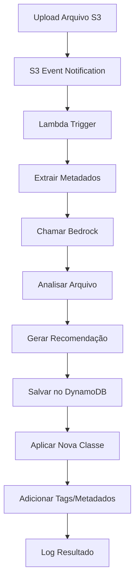

# 🏗️ Arquitetura do S3 Optimizer - TDC 2025

## 📋 Visão Geral

O **S3 Optimizer** é um sistema serverless que automatiza a otimização de custos de armazenamento no Amazon S3, utilizando inteligência artificial via Amazon Bedrock para analisar arquivos e recomendar a classe de armazenamento mais adequada.

## 🎯 Objetivo

Reduzir custos de armazenamento S3 através da análise inteligente e aplicação automática das classes de armazenamento mais eficientes para cada tipo de arquivo.

## 🔧 Componentes da Arquitetura

### 1. **Amazon S3 Bucket** 
- **Função**: Armazenamento de arquivos e trigger de eventos
- **Configuração**: Event Notifications para `ObjectCreated:Put`
- **Responsabilidade**: Disparar eventos quando novos arquivos são enviados

### 2. **AWS Lambda Function**
- **Função**: Processamento principal da aplicação
- **Runtime**: Python 3.9
- **Timeout**: 300 segundos
- **Memory**: 512 MB
- **Responsabilidades**:
  - Processar eventos S3
  - Extrair metadados dos arquivos
  - Chamar Amazon Bedrock para análise
  - Salvar insights no DynamoDB
  - Aplicar classes de armazenamento recomendadas

### 3. **Amazon Bedrock**
- **Modelo**: Claude 3 Sonnet (anthropic.claude-3-sonnet-20240229-v1:0)
- **Função**: Análise inteligente de arquivos
- **Input**: Metadados do arquivo (nome, tamanho, tipo, content-type)
- **Output**: Recomendação de classe de armazenamento com justificativa

### 4. **Amazon DynamoDB**
- **Tabela**: `s3-optimizer-insights`
- **Billing Mode**: Pay-per-request
- **TTL**: 1 ano (365 dias)
- **Função**: Armazenar histórico de análises e recomendações
- **Estrutura**:
  ```json
  {
    "file_id": "bucket/arquivo.pdf",
    "bucket_name": "meu-bucket",
    "object_key": "arquivo.pdf",
    "file_size": 2048000,
    "file_type": "pdf",
    "original_storage_class": "STANDARD",
    "recommended_storage_class": "STANDARD_IA",
    "reasoning": "Documento PDF de tamanho médio...",
    "confidence": "alta",
    "analyzed_at": "2024-01-01T10:00:00Z"
  }
  ```

### 5. **Amazon CloudWatch**
- **Função**: Monitoramento e logs
- **Log Group**: `/aws/lambda/s3-optimizer-function`
- **Métricas**: Execuções, erros, duração

### 6. **AWS IAM**
- **Role**: `LambdaExecutionRole`
- **Políticas**:
  - S3: GetObject, PutObject, HeadObject, CopyObject, Tagging
  - Bedrock: InvokeModel
  - DynamoDB: PutItem, GetItem, UpdateItem
  - CloudWatch: Logs

## 🔄 Fluxo de Execução



### Detalhamento do Fluxo:

1. **Upload de Arquivo** 📤
   - Usuário faz upload de arquivo para o bucket S3
   - S3 detecta evento `ObjectCreated:Put`

2. **Trigger Lambda** ⚡
   - S3 envia evento para função Lambda
   - Lambda extrai `bucket_name` e `object_key` do evento

3. **Extração de Metadados** 📊
   - `s3_client.head_object()` obtém informações do arquivo
   - Extrai: tamanho, tipo, content-type, classe atual

4. **Análise com Bedrock** 🤖
   - Monta prompt com metadados do arquivo
   - Chama Claude 3 Sonnet via `bedrock_client.invoke_model()`
   - Recebe recomendação em JSON

5. **Salvamento de Insight** 💾
   - Armazena análise completa no DynamoDB
   - Inclui timestamp e TTL de 1 ano

6. **Aplicação da Classe** 🔄
   - `s3_client.copy_object()` com nova StorageClass
   - Adiciona metadados customizados
   - Aplica tags de rastreamento

## 📊 Classes de Armazenamento S3

| Classe | Uso Recomendado | Custo | Recuperação |
|--------|----------------|-------|-------------|
| **STANDARD** | Acesso frequente | Alto | Imediato |
| **STANDARD_IA** | Acesso infrequente | Médio | Imediato |
| **GLACIER** | Arquivamento | Baixo | Minutos/Horas |
| **DEEP_ARCHIVE** | Arquivamento longo prazo | Muito Baixo | 12 horas |

## 🧠 Lógica de Recomendação (Bedrock)

O Amazon Bedrock considera:

- **Tamanho do Arquivo**: Arquivos <128KB não se beneficiam de IA
- **Tipo de Arquivo**: 
  - Logs/Backups → GLACIER
  - Documentos → STANDARD_IA
  - Imagens ativas → STANDARD
- **Padrão de Acesso**: Baseado no tipo e contexto
- **Custo-Benefício**: Análise de economia vs. necessidade

## 🏷️ Metadados e Tags Aplicados

### Metadados S3:
```json
{
  "file-size-bytes": "2048000",
  "optimized-by": "S3Optimizer",
  "recommended-class": "STANDARD_IA",
  "confidence": "alta",
  "optimized-at": "2024-01-01T10:00:00Z"
}
```

### Tags S3:
```json
[
  {"Key": "OptimizedBy", "Value": "S3Optimizer"},
  {"Key": "RecommendedClass", "Value": "STANDARD_IA"},
  {"Key": "Confidence", "Value": "alta"},
  {"Key": "OptimizedAt", "Value": "2024-01-01T10:00:00Z"},
  {"Key": "FileSizeBytes", "Value": "2048000"}
]
```

## 🔒 Segurança

- **Princípio do Menor Privilégio**: IAM roles com permissões mínimas
- **Criptografia**: S3 e DynamoDB com criptografia em repouso
- **VPC**: Lambda pode ser configurada em VPC privada
- **Logs**: CloudWatch para auditoria completa

## 📈 Escalabilidade

- **Lambda**: Auto-scaling até 1000 execuções concorrentes
- **DynamoDB**: Pay-per-request, escala automaticamente
- **S3**: Suporta trilhões de objetos
- **Bedrock**: Gerenciado pela AWS, alta disponibilidade

## 💰 Estimativa de Custos

### Por 1000 arquivos processados:
- **Lambda**: ~$0.02 (execuções + compute)
- **Bedrock**: ~$0.30 (Claude 3 Sonnet)
- **DynamoDB**: ~$0.01 (writes)
- **S3**: Custo de storage otimizado (economia de 20-60%)

**ROI**: Economia significativa em storage compensa custos de processamento

## 🧪 Testes e Validação

### Testes Implementados:
- **Demo Simples**: Sem necessidade de conta AWS
- **Testes Mocados**: Simulação completa das APIs
- **Testes Unitários**: Cobertura de todas as funções
- **Testes de Integração**: Fluxo completo end-to-end

### Cenários Testados:
- Arquivos pequenos (<128KB)
- Arquivos médios (1-100MB)
- Arquivos grandes (>1GB)
- Diferentes tipos: PDF, ZIP, TXT, JPG
- Tratamento de erros e fallbacks

## 🚀 Deploy e Infraestrutura

### CloudFormation Template:
- **Recursos**: 5 componentes principais
- **Parâmetros**: Bucket name configurável
- **Outputs**: ARNs e nomes dos recursos
- **Deploy**: Automatizado via SAM CLI

### Comandos de Deploy:
```bash
./deploy.sh meu-bucket-s3
```

## 📊 Monitoramento

### Métricas Principais:
- **Arquivos Processados**: Count por período
- **Classes Aplicadas**: Distribuição por tipo
- **Economia Estimada**: Cálculo baseado em tamanhos
- **Erros**: Rate de falhas e tipos
- **Latência**: Tempo de processamento

### Dashboards:
- CloudWatch Dashboard customizado
- Alertas para erros e alta latência
- Relatórios de economia de custos

## 🔮 Roadmap Futuro

### Melhorias Planejadas:
- **ML Personalizado**: Treinar modelo específico
- **Políticas Customizadas**: Regras por bucket/pasta
- **Interface Web**: Dashboard para visualização
- **Relatórios**: Análise de economia detalhada
- **Integração**: Slack/Teams para notificações

---

**Desenvolvido para TDC 2025 - Q Developer Quest**  
**Autor**: TorMenezes  
**Tag**: `q-developer-quest-tdc-2025`